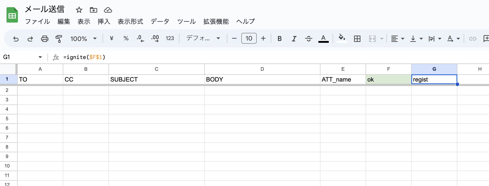

## GAS mail queue sample
- time based triggers
- sendmail with html/attached file

spread sheet's sample


## from Your Server
- sync value for this spread sheet from your server's script
- sync file for your Drive from your server's script
    such as [ref this repo](https://github.com/serna37/scraping_gcp))

## how custom
here.
you can use html in `GmailApp.sendMail`
```.js
    // 3. 送信
    let options = {cc: cc, name: 'おしらせbot'}
    if (attF !== "") { options.attachments = attF }
    if (attF !== "" && attNm.endsWith("png") || attNm.endsWith("jpg")) {
      body = body.replaceAll('\n', '<br>')
      body += `<br>`
      options["htmlBody"] = body
      options["inlineImages"] = { inlineImg: attF }
    }
```
